# devops-lifecycle
DevOps lifecycle of a simple app.

This project showcases the differents steps of the DevOps lifecycle of a simple app:

- API Code: Python (Django), sqlite

- Test: Python (django.test.testcase)

- Continuous integration: Github actions

- Continuous deployment: Github actions + Render

- Virtual environment provisioning using the IaC approach: Vangrant, Ansible

- Contenerisation: Docker, Docker Compose

- Orchestration: Kubernetes

- Service mesh: Istio

-Monitoring: Prometheus, Grafana

## Installations
##### Python >= 3.10
Install a python version greater or equal to 3.10: https://www.python.org/downloads/
Install a python environment manager, like virtualenv for exemple: https://virtualenv.pypa.io/en/latest/installation.html  

##### Vagrant
Install Vagrant: https://developer.hashicorp.com/vagrant/install

##### Virtualbox
Install virtual box: https://www.virtualbox.org/wiki/Downloads

##### Ansible
Install Ansible: https://docs.ansible.com/ansible/latest/installation_guide/intro_installation.html

##### Minikube
Install Minikube: https://minikube.sigs.k8s.io/docs/start/?arch=%2Flinux%2Fx86-64%2Fstable%2Fbinary+download

##### Docker
Install Docker: https://docs.docker.com/engine/install/


## Running the API
Create a python virtual environment
```bash
python3.10 -m venv myenv
```
Activate the created environment
```bash
cd myenv
source ./myenv/bin/activate
```
Install the requirements
```bash
cd userapi
pip install -r requirements.txt
```

Create and migrate the database
```bash
python3 manage.py makemigrations
python3 manage.py migrate
```

Run the API
```bash
python3 manage.py runserver
```
Access the swagger UI through your browser at http://127.0.0.1:8000/api/swagger/

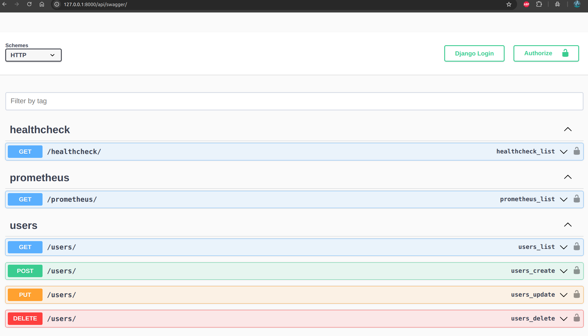

Get the list of users, Add, Update users informations and delete users thought the differents endpoints.


## Running unittests on enpoints and functions

The folder userapi/api contains two files for testing:
-tests_functions.py: to test critical fonctions
-tests_urls.py: to test the endpoints that are meant to be used by the user

Launch the functions test by executing:
```bash
cd userapi
python3 manage.py test -v2 api.tests_functions
```
"-v2" is for a detailled output
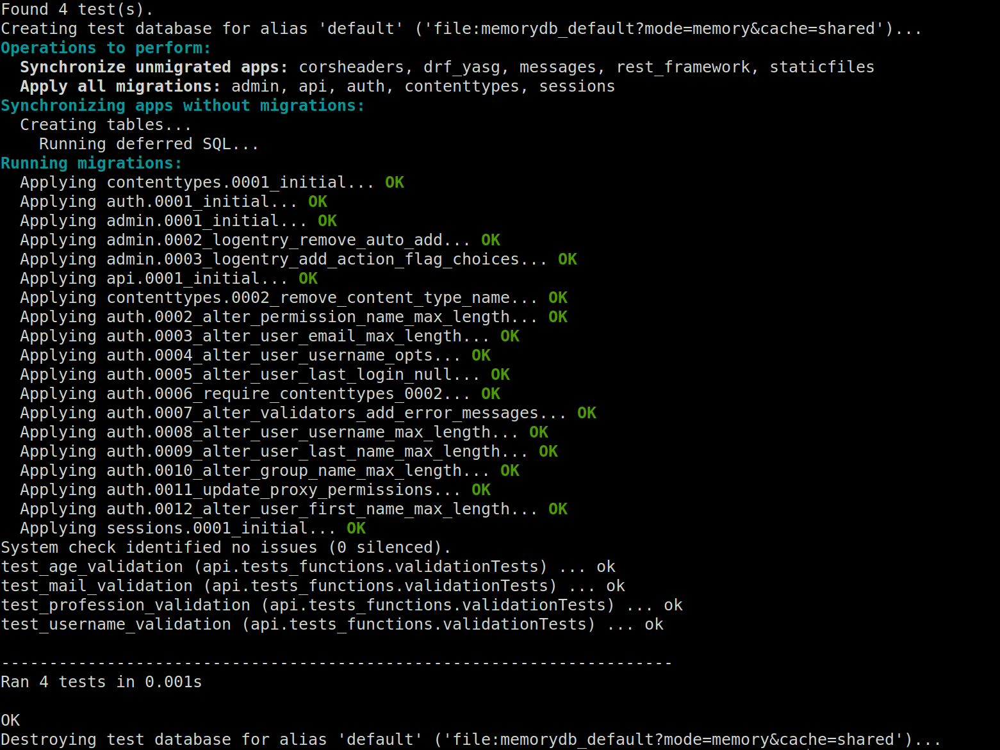

Launch the endpoints test by executing:
```bash
cd userapi
python3 manage.py test -v2 api.tests_urls
```
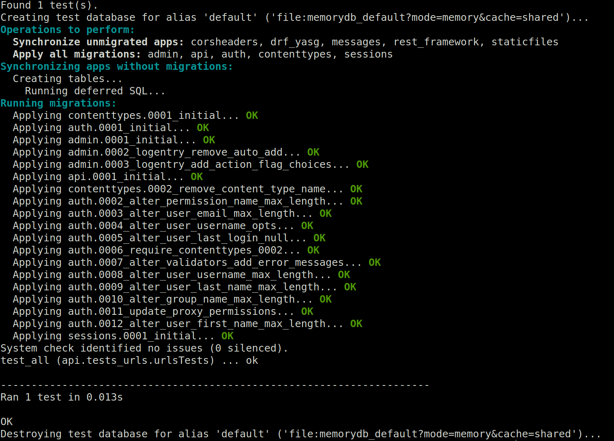

Here we run all the url tests in one test because we want them to be run in a certain order:
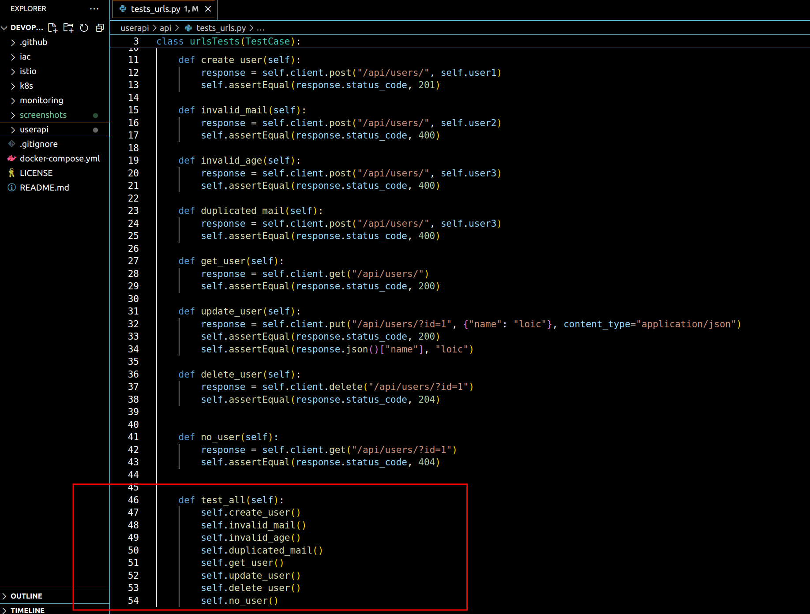

## CI/CD
The file django_CI_CD.yml in the .github include the instructions to build the project and run the tests all the tests, then, if everything is working well, the project will be deployed.

For the deployment, we used [render](https://render.com), a platform allowing to deploy easily the content of a github repository.
After linking your repository, you need to provide the build, start commands and to generate a deploy_hook. It is an url that will trigger the deployment of your app.
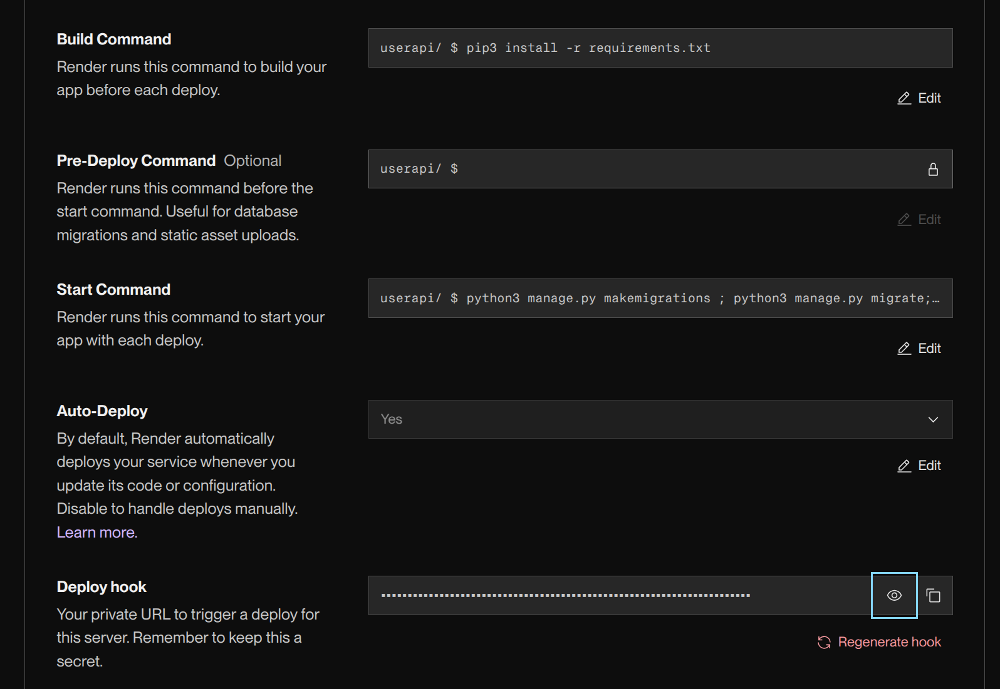

Instead of hard coding the deploy_hook in your github action file, create an action secret in your settings, set it to the value of the deploy_hook, and use the secret name.

Example with github:
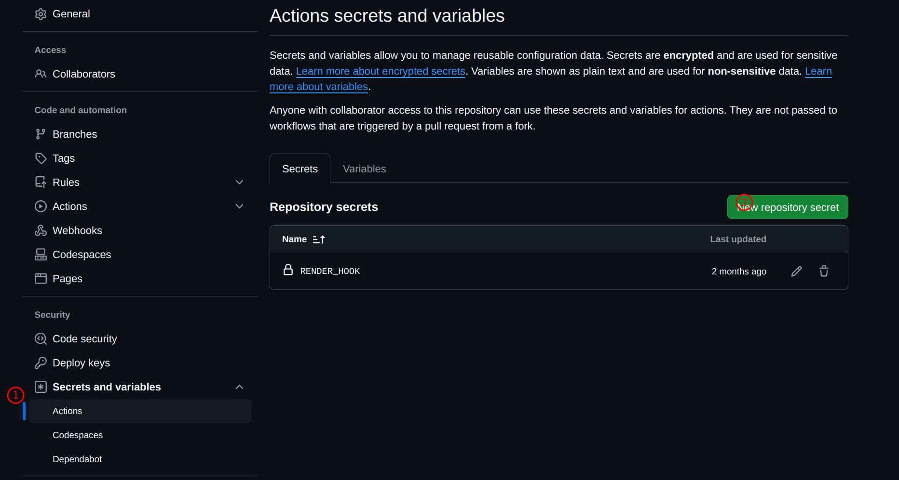

Each time, you will push something in your repository, the tests will be executed and the project will be deployed automatically.
Note: We are using a free server instance on render which spin down with inactivity, so the first time you hit the link, the web page can be delayed by 50 seconds or more.

Access the swagger of the production version of this repository API here: https://devops-lifecycle.onrender.com/api/swagger/


## Infrastructure as code

Here, we use Vangrant to automate the creation of a virtual machine with 1 cpu and 2048 of memory, and forward the 80 port of this machine to the 8080 of our machine.
Then, we use Ansible, to provision the machine with the application and the environment needed to run it and a healthcheck.

Start by downloading the Unbuntu Vagrant box for the Virtualbox provider:
```bash
cd iac/
vagrant box add ubuntu/focal64
```
Choose virtualbox as provider.

In the vagrant file, we used the synced folders option to allow the synchronisation between the project files from the host and the guest.
Launch the creation and provision the vm:
```bash
vagrant up
```

Vm configuration logs:
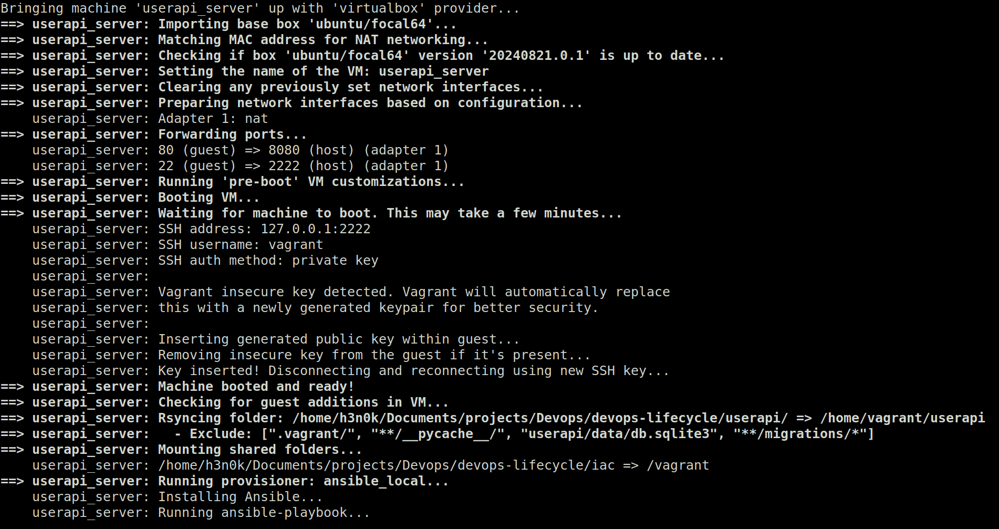

Vm provisioning logs: 
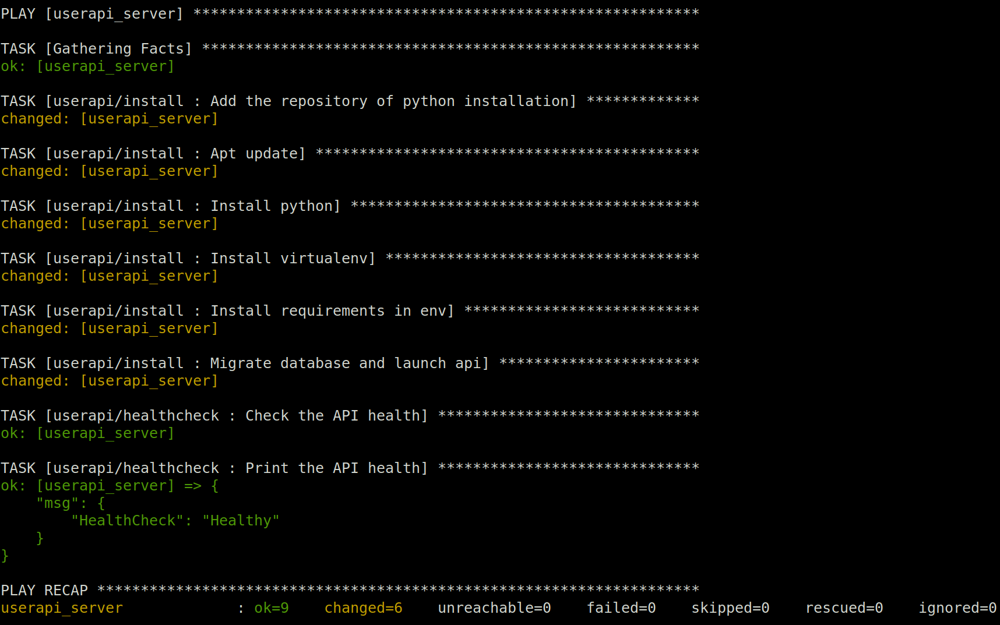

Note that a vm is running in virtualbox:
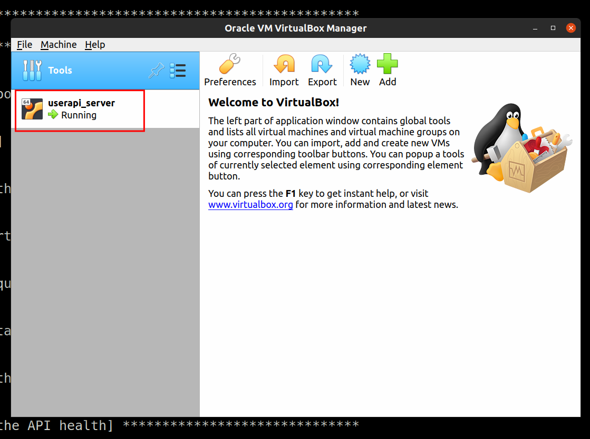

Then, you can access the swagger ui via the port 8080 of your machine, as we configured it.
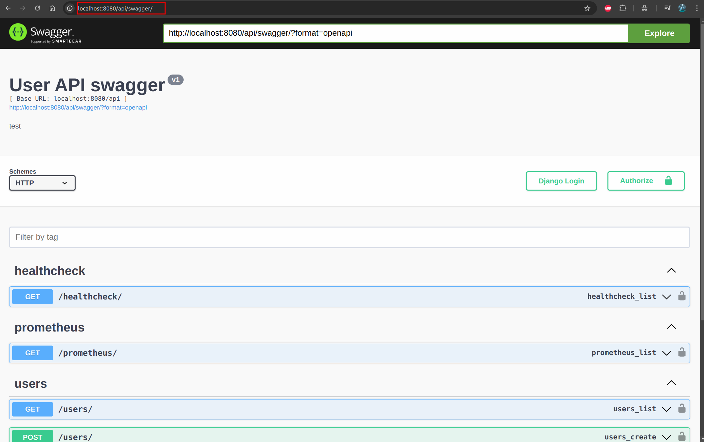

## Contenerisation
To obtain an image of the api, you can:

- Build it from the docker file:
```bash
docker build -t user-api-app userapi/
```
- Pull the image from the docker hub
```bash
docker pull henokoder/user-api-app
```

Run the image thanks to the docker compose at the root of the repository
```bash
cd ../
docker compose up
```
you can add the option "-d" to run it in background.

Thanks to the port mapping, you can access the api from your browseron port 8000:
http://localhost:8000/api/swagger/


## Orchestration

Start minikube.
```bash
minikube start
```

Deploy the application on kubernetes thanks to the manifests: deployments-v1.yaml, deployments-v2.yaml, service.yaml, volume.yaml.
We decided have two versions of the deployment for request shifting in the next part.
But they use the same version of the api image.

The volume file contains the definition of a persistent volume and a persistent volume claim in order for the deployments to persist the sqlite database file.

```bash
cd k8s/
kubectl apply -f .
```

You should see the confirmation of the resource created:
```bash
deployment.apps/userapi-deployment-v1 created
deployment.apps/userapi-deployment-v2 created
service/userapi-service created
persistentvolume/userapi-pv created
persistentvolumeclaim/userapi-pvc created
```

Print the pods and Wait them to be in a running state:
```bash
kubectl get pods
```
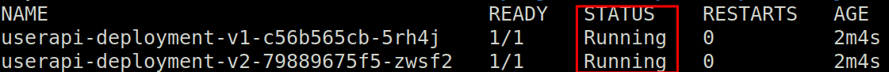

Then run:
```bash
minikube service userapi-service
```

An instance will be opened in your browser.
Even if you delete a pod with kubectl delete pod <podname>, another one will be instantly recreated.

To test the volume persistance, you can create a user though the swagger and then delete and recreate the service. The user created will still be there.

## Service mesh
First, download and install istio and the Kubernetes Gateway API CRDs by followinf the instructions [here](https://istio.io/latest/docs/setup/getting-started/).

In a virtual service, we routed GET AND DELETE requests to v1 and POST and PUT requests to v2 of the app. We also did a traffic shifting by applying 50 of the requests weight on each version.
To apply those configs, run:
```bash
cd istio/
kubectl apply -f .
```

## Monitoring
Create prometheus and grafana resources:
```bash
cd monitoring/
kubectl apply -f .
```
For prometheus, we used the addons from the istio samples and we customized it by editing the type of node to NodePort (same for grafana) in order for it to be accessible from our machine.
We also added to Prometheus config, a job to scrape data about the health of the API from an endpoint created for it.
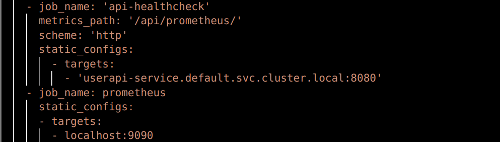

Prometheus and grafana services have been created in the namespace istio-system.
Check the status of their pods in the that namespace:
```bash
kubectl get pods -n istio-system
```
Wait for them to have the 'running' status before accessing them:
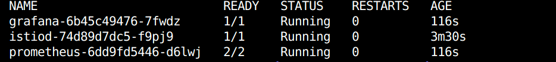

To access them:
```bash
minikube service -n istio-system prometheus
minikube service -n istio-system grafana
```

Go to the target in prometheus and remark that the healtcheck job is up.
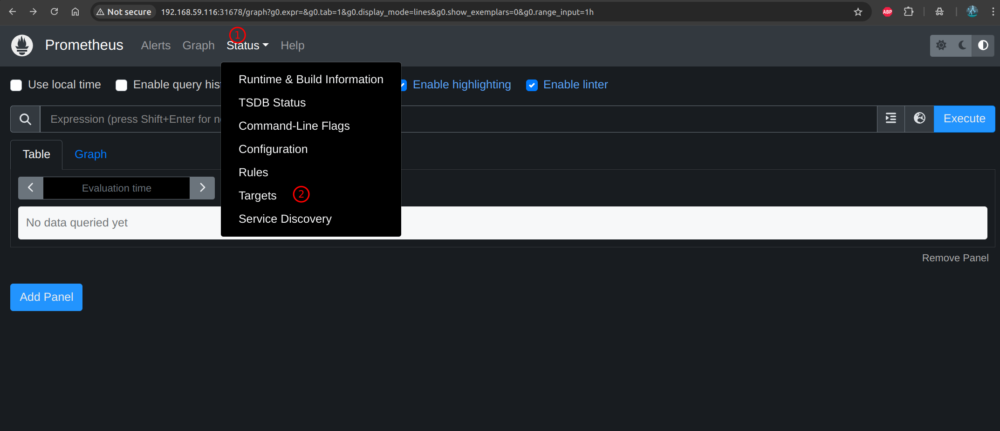
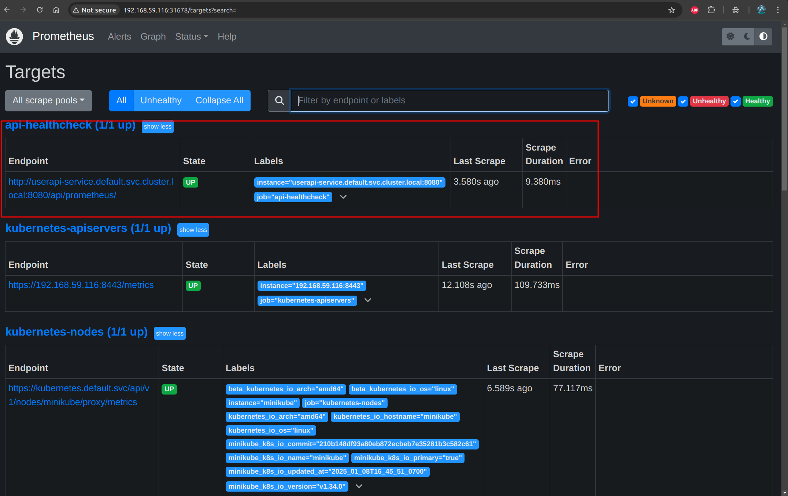

Then, go on the grafana page.
We have prepared some dashboards to allow the monitoring of the kubernetes infrastructure and the health of the API. You will have to import them.
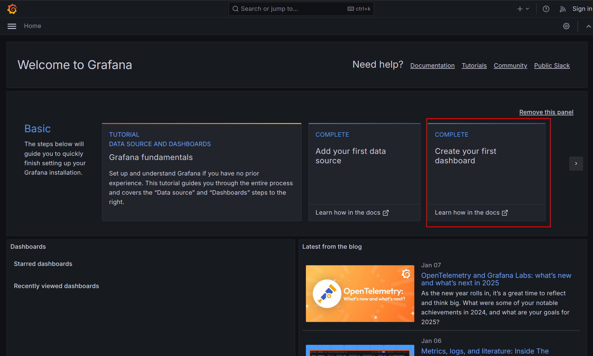
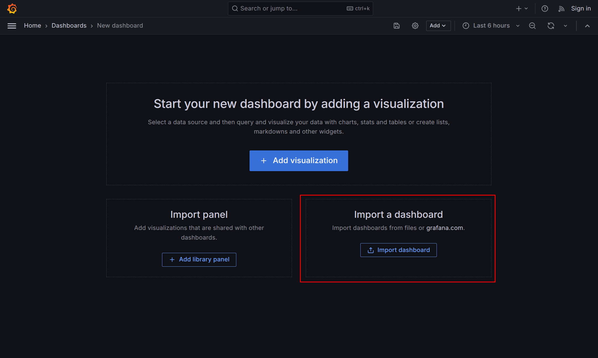
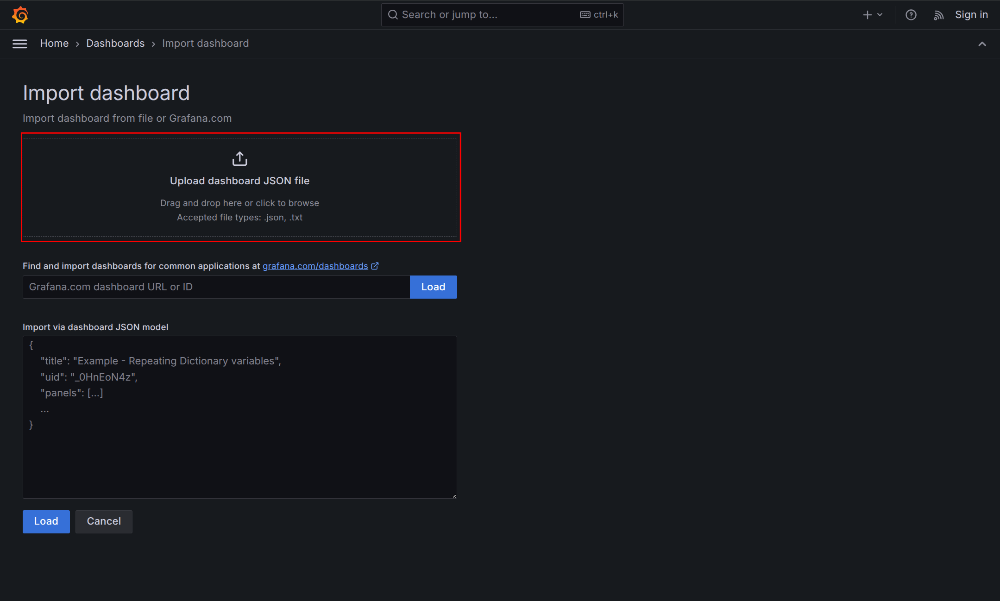

Import them from the json files in /monitoring/boards.

Kubernetes monitoring:
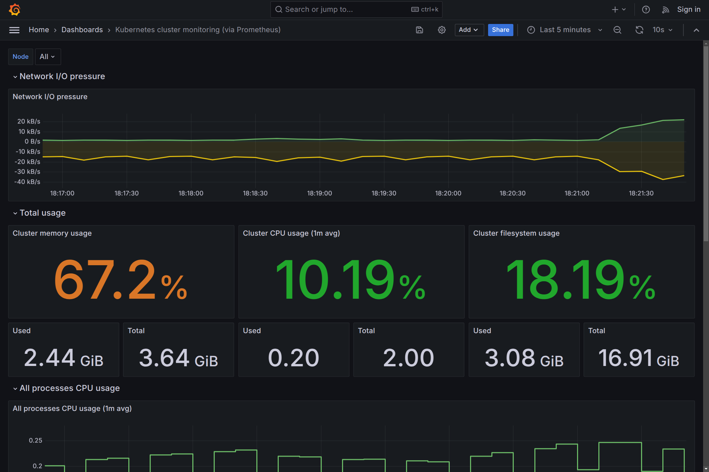
Scroll dow to see more metrics

API health:
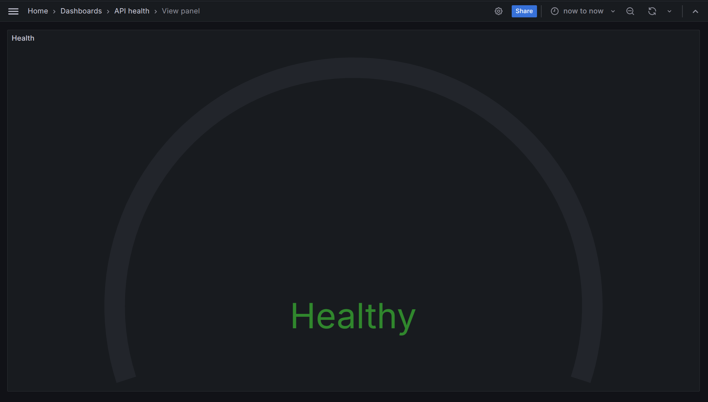

Try do delete the pods.
First, get the pods names.
```bash
kubectl get pods
NAME                                     READY   STATUS    RESTARTS   AGE
userapi-deployment-v1-c56b565cb-5rh4j    1/1     Running   0          106m
userapi-deployment-v2-79889675f5-zwsf2   1/1     Running   0          106m
userapi-gateway-istio-85d8475fbf-kwjc5   1/1     Running   0          67m
```
Delete them
```bash
kubectl delete pods userapi-deployment-v1-c56b565cb-5rh4j userapi-deployment-v2-79889675f5-zwsf2
```

While the deleted pods are being re created, check the status of the API on grafana:


## Authors
Hénok Agbodjogbe and Loic Martins
